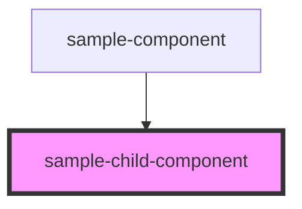

# sample-child-component

<!-- Auto Generated Below -->

## Properties

| Property    | Attribute    | Description | Type     | Default                                               |
| ----------- | ------------ | ----------- | -------- | ----------------------------------------------------- |
| `childName` | `child-name` |             | `string` | `'no children at all withou param to parent comp :/'` |

## Dependencies

### Used by

 - [sample-component](../sample-component)

### Graph

----------------------------------------------

*Built with [StencilJS](https://stenciljs.com/)*
