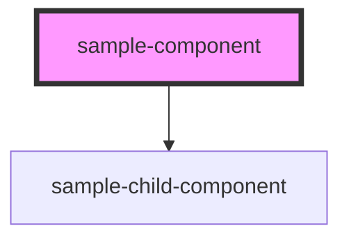

# sample-component

<!-- Auto Generated Below -->

## Properties

| Property      | Attribute      | Description | Type     | Default   |
| ------------- | -------------- | ----------- | -------- | --------- |
| `bestDrummer` | `best-drummer` |             | `string` | `'World'` |

## Methods

### `updateStatement() => Promise<void>`

#### Returns

Type: `Promise<void>`

## Dependencies

### Depends on

- [sample-child-component](../sample-child-component)

### Graph

----------------------------------------------

*Built with [StencilJS](https://stenciljs.com/)*
